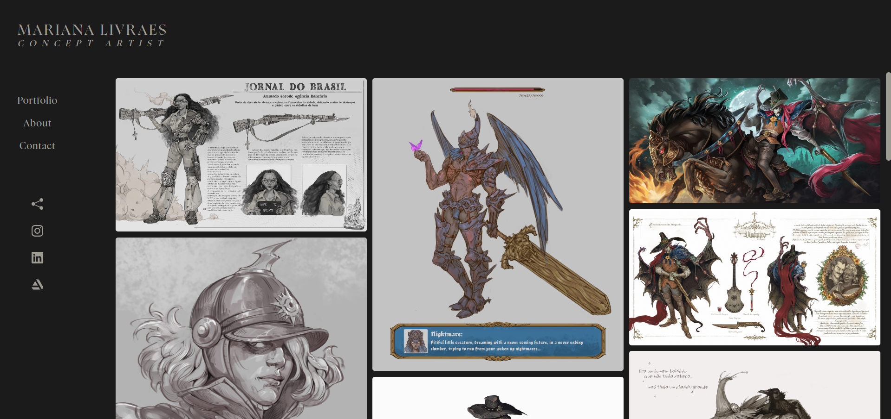

# Site Portfólio Artístico



Este repositório contém o código fonte do site de portfólio artístico desenvolvido para a artista Mariana Livraes. O site foi criado para exibir suas obras e permitir a interação com os visitantes.

## Tecnologias Utilizadas

- **React.js**: Biblioteca JavaScript para construção de interfaces de usuário.
- **JavaScript**: Linguagem de programação utilizada no desenvolvimento.
- **CSS-in-JS com styled-components**: Para estilização dos componentes.
- **React Responsive Masonry**: Biblioteca utilizada para a galeria de imagens responsiva.

## Funcionalidades

- **Navegação de Imagens**: Os visitantes podem visualizar e navegar entre as imagens do portfólio.
- **Seções do Site**:
  - **Portfólio**: Exibição das obras artísticas.
  - **About**: Informações sobre a artista.
  - **Contact**: Formulário para envio de e-mails diretamente para a artista.
- **Formulário de Contato**: Possibilidade de enviar um e-mail diretamente para a artista através da seção de contato.
- **Compartilhamento e Redes Sociais**: Opções de compartilhamento e links para as redes sociais da artista.
- **Build e Deploy**: Feitos utilizando a plataforma Vercel.

## Como Executar o Projeto

1. Clone este repositório:
```bash
   git clone https://github.com/GuihCastro/site-portfolio-mary.git
```

2. Navegue até o diretório do projeto:
```bash
   cd site-portfolio-mary
```

3. Instale as dependências:
```bash
   npm install
```

4. Inicie o servidor de desenvolvimento:
```bash
   npm run dev
```

5. Abra o navegador e acesse `http://localhost:3000`(ou outro número apropriado para porta no seu servidor local, que será indicado após o comando).

## Link para o Site no Ar

[https://marianalivraes.com/](https://marianalivraes.com/)

---

Desenvolvido por Guilherme Henrique de Castro.
